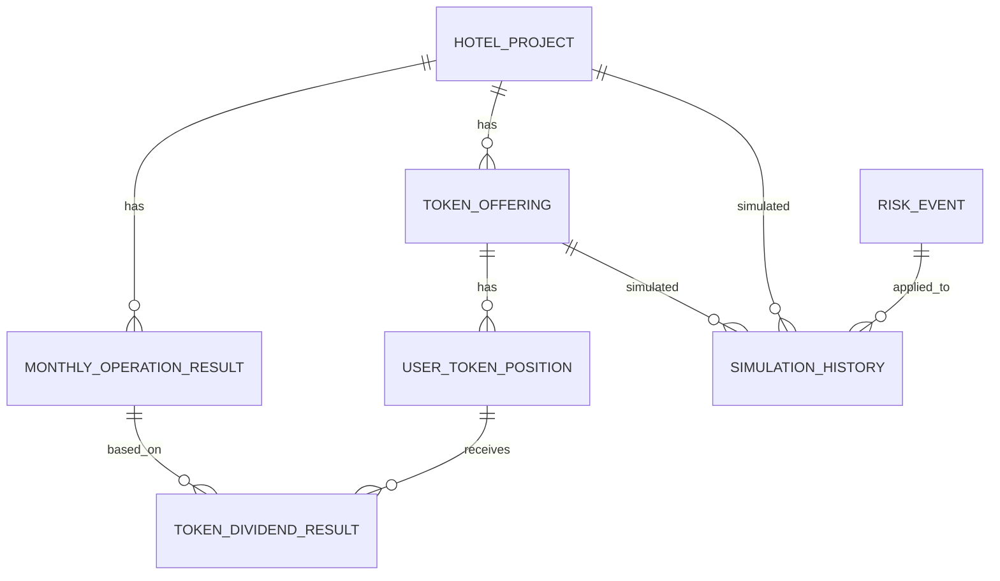

# Hotel STO Lab 통합 기획·설계 문서

## 0. 프로젝트 한 줄 정의

**Hotel STO Lab**은 호텔 객실 운영 수익을 기반으로 토큰증권(STO) 구조, 배당가능이익, 투자자별 배당금, 수익률 변동, 리스크 이벤트를 학습하는 **금융교육형 시뮬레이션 플랫폼**이다.

영문 설명:

> A hotel revenue-based STO simulation platform for learning tokenized securities, investment returns, and hospitality asset financing.

---

## 1. 프로젝트 개요

| 항목 | 내용 |
|---|---|
| 프로젝트명 | Hotel STO Lab |
| 서비스 유형 | 금융교육 시뮬레이션 / 호텔 수익 기반 STO 학습 플랫폼 |
| 핵심 자산 | 호텔 객실 운영 수익 |
| 핵심 학습 주제 | STO, 조각투자, 투자계약증권, 배당가능이익, 수익률, 호텔 운영 리스크 |
| 주요 기술 | Java, Spring Boot, TypeScript, React, PostgreSQL |
| 핵심 포지션 | 실제 투자 플랫폼이 아닌 교육용 모의 시뮬레이션 |

### 1.1 기획 의도

호텔은 객실 수, 객실 점유율, 평균 객실단가(ADR), 운영비율이라는 수익 변수가 명확하다. 따라서 호텔 운영 수익은 STO 배당 구조를 학습하기에 적합한 예시 자산이다.

이 프로젝트는 다음 흐름을 사용자가 직접 확인하게 한다.

```text
호텔 객실 운영 데이터
→ 월별 객실매출 계산
→ 운영비 차감
→ 배당가능이익 산출
→ 가상 토큰 보유비율 계산
→ 투자자별 배당금 계산
→ 월 수익률 및 누적 수익률 확인
→ 리스크 이벤트 전후 비교
```

### 1.2 준법 포지션

본 프로젝트는 실제 STO 발행, 투자자 모집, 청약, 결제, 매매, 배당 지급 기능을 제공하지 않는다. 모든 투자금, 토큰 수량, 배당금, 수익률은 교육용 시뮬레이션 값이다.

필수 고지 문구:

```text
본 서비스는 STO와 호텔 수익구조를 학습하기 위한 교육용 시뮬레이션입니다.
실제 투자상품의 청약, 매수, 매도, 배당 지급, 투자 권유 기능을 제공하지 않습니다.
표시되는 토큰 수량, 보유비율, 수익률, 배당금은 가상의 조건에 따른 계산 결과입니다.
```

### 1.3 제도 참고

금융위원회는 토큰증권을 분산원장 기술을 활용해 자본시장법상 증권을 디지털화한 것으로 설명하고, 증권에 해당하는 디지털자산은 자본시장법상 증권 규제를 준수해야 한다고 밝혔다. 또한 2026년 1월 15일 토큰증권 도입 및 투자계약증권 유통을 위한 전자증권법·자본시장법 개정안이 국회 본회의를 통과했다.

참고 출처:
- 금융위원회, 「토큰 증권(Security Token) 발행·유통 규율체계 정비방안」, 2023-02-06
- 금융위원회, 「전자증권법·자본시장법 개정안 국회 본회의 통과」, 2026-01-15

---

## 2. 1단계 산출물: 프로젝트 개요, 시장·제도 조사, README

### 2.1 README 초안

```md
# Hotel STO Lab

Hotel STO Lab is a financial education simulation platform that helps users understand tokenized securities, hotel operating revenue, dividend distribution, and investment return simulation.

This project does not issue real securities or tokens. It is designed for educational and portfolio purposes only.

## Key Features

- Hotel revenue simulation based on occupancy rate, ADR, and operating cost
- Virtual token ownership ratio calculation
- Dividend simulation based on distributable profit
- Monthly ROI visualization
- Risk event simulation for hotel operation variables

## Core Flow

Hotel operation data
→ Monthly room revenue
→ Operating cost deduction
→ Distributable profit
→ Token ownership ratio
→ Investor dividend
→ Monthly ROI
```

### 2.2 프로젝트 범위

| 포함 | 제외 |
|---|---|
| 호텔 수익 계산 | 실제 증권 발행 |
| 가상 토큰 수량 계산 | 실제 토큰 발행 |
| 보유비율 계산 | 실제 청약·결제 |
| 배당가능이익 계산 | 실제 매수·매도 |
| 예상 배당금 계산 | 실제 배당 지급 |
| 리스크 이벤트 시뮬레이션 | 지갑·블록체인 메인넷 연동 |

---

## 3. 2단계 산출물: 호텔 수익 계산 로직

### 3.1 주요 변수

| 변수 | 영문명 | 설명 |
|---|---|---|
| 객실 수 | `roomCount` | 판매 가능한 호텔 객실 수 |
| 영업일수 | `operatingDays` | 월 영업일수 |
| 객실 점유율 | `occupancyRate` | 판매된 객실 비율 |
| 평균 객실단가 | `adr` | Average Daily Rate |
| 부대매출률 | `additionalRevenueRate` | 객실매출 대비 부대매출 비율 |
| 운영비율 | `operatingCostRate` | 총매출 대비 운영비 비율 |
| 예비비율 | `reserveRate` | 영업이익 중 예비비 적립 비율 |

### 3.2 계산식

```text
roomRevenue = roomCount × operatingDays × occupancyRate × adr
additionalRevenue = roomRevenue × additionalRevenueRate
totalRevenue = roomRevenue + additionalRevenue
operatingCost = totalRevenue × operatingCostRate
operatingProfit = totalRevenue - operatingCost
reserveAmount = operatingProfit × reserveRate
distributableProfit = max(0, operatingProfit - reserveAmount)
```

### 3.3 예시

| 항목 | 값 |
|---|---:|
| 객실 수 | 80개 |
| 영업일수 | 30일 |
| 점유율 | 68% |
| ADR | 110,000원 |
| 부대매출률 | 12% |
| 운영비율 | 58% |
| 예비비율 | 10% |

계산 결과:

| 항목 | 결과 |
|---|---:|
| 객실매출 | 179,520,000원 |
| 부대매출 | 21,542,400원 |
| 총매출 | 201,062,400원 |
| 운영비 | 116,616,192원 |
| 영업이익 | 84,446,208원 |
| 예비비 | 8,444,621원 |
| 배당가능이익 | 76,001,587원 |

---

## 4. 3단계 산출물: STO 토큰 발행 구조 시뮬레이션

### 4.1 기본 구조

실제 토큰 발행이 아니라 가상 모집금액과 가상 토큰 가격을 기준으로 보유비율을 계산한다.

```text
totalTokenSupply = totalOfferingAmount ÷ tokenPrice
userTokenQuantity = investmentAmount ÷ tokenPrice
ownershipRatio = userTokenQuantity ÷ totalTokenSupply
ownershipRatio = investmentAmount ÷ totalOfferingAmount
dividendRightRatio = ownershipRatio
```

### 4.2 예시

| 항목 | 값 |
|---|---:|
| 총 모집금액 | 1,000,000,000원 |
| 토큰 가격 | 10,000원 |
| 총 토큰 발행량 | 100,000개 |
| 사용자 투자금 | 1,000,000원 |
| 사용자 보유 토큰 | 100개 |
| 보유비율 | 0.1% |

### 4.3 배당 계산

```text
investorDividend = distributableProfit × ownershipRatio
monthlyRoi = investorDividend ÷ investmentAmount × 100
annualizedRoi = monthlyRoi × 12
```

예시:

| 항목 | 값 |
|---|---:|
| 배당가능이익 | 76,001,587원 |
| 보유비율 | 0.1% |
| 투자자 배당금 | 76,001원 |
| 월 수익률 | 7.60% |

---

## 5. 4단계 산출물: DB 설계

### 5.1 핵심 테이블

| 테이블 | 역할 |
|---|---|
| `hotel_project` | 호텔 프로젝트 기본 정보 |
| `token_offering` | 가상 STO 발행 조건 |
| `user_token_position` | 사용자 모의 투자 포지션 |
| `monthly_operation_result` | 월별 호텔 운영 결과 |
| `token_dividend_result` | 사용자별 배당 계산 결과 |
| `risk_event` | 리스크 이벤트 정의 |
| `simulation_history` | 시뮬레이션 실행 이력 |

### 5.2 ERD



### 5.3 DB 설계 원칙

| 원칙 | 설명 |
|---|---|
| 실제 금융거래 테이블 제외 | payment, trade, wallet, securities_account는 제외 |
| 금액은 정수 저장 | 원 단위 `BIGINT` 사용 |
| 비율은 정밀값 저장 | `NUMERIC(8,6)`, `NUMERIC(12,10)` 사용 |
| 계산 이력 보존 | `simulation_history`에 입력·결과 JSON 저장 |
| 주석 필수 | 모든 주요 테이블과 컬럼에 `COMMENT` 추가 |

상세 SQL은 별도 파일 `hotel_sto_lab_schema.sql`에 포함한다.

---

## 6. 5단계 산출물: API 명세

### 6.1 주요 API

| 구분 | Method | Endpoint | 설명 |
|---|---|---|---|
| 호텔 | GET | `/api/hotels` | 호텔 프로젝트 목록 조회 |
| 호텔 | GET | `/api/hotels/{hotelId}` | 호텔 상세 조회 |
| 발행조건 | GET | `/api/offerings` | 가상 STO 발행 조건 목록 조회 |
| 발행조건 | GET | `/api/offerings/{offeringId}` | 발행 조건 상세 조회 |
| 수익계산 | POST | `/api/simulations/hotel-revenue` | 호텔 수익 계산 |
| 토큰계산 | POST | `/api/simulations/token-offering` | 토큰 보유비율 계산 |
| 배당계산 | POST | `/api/simulations/dividend` | 배당금 계산 |
| 통합계산 | POST | `/api/simulations/full` | 호텔 수익 + 토큰 + 배당 통합 계산 |
| 리스크 | GET | `/api/risk-events` | 리스크 이벤트 목록 조회 |
| 리스크 적용 | POST | `/api/simulations/risk-event` | 리스크 이벤트 적용 전후 비교 |

### 6.2 통합 시뮬레이션 요청 예시

```json
{
  "hotelId": "HOTEL-001",
  "offeringId": "OFFERING-001",
  "roomCount": 80,
  "operatingDays": 30,
  "occupancyRate": 0.68,
  "adr": 110000,
  "additionalRevenueRate": 0.12,
  "operatingCostRate": 0.58,
  "reserveRate": 0.10,
  "totalOfferingAmount": 1000000000,
  "tokenPrice": 10000,
  "investmentAmount": 1000000
}
```

### 6.3 통합 시뮬레이션 응답 예시

```json
{
  "revenue": {
    "roomRevenue": 179520000,
    "additionalRevenue": 21542400,
    "totalRevenue": 201062400,
    "operatingCost": 116616192,
    "operatingProfit": 84446208,
    "reserveAmount": 8444621,
    "distributableProfit": 76001587
  },
  "token": {
    "totalTokenSupply": 100000,
    "userTokenQuantity": 100,
    "ownershipRatio": 0.001,
    "ownershipRatioPercent": 0.1,
    "dividendRightRatio": 0.001
  },
  "dividend": {
    "investorDividend": 76001,
    "monthlyRoi": 7.60,
    "annualizedRoi": 91.20
  },
  "educationComment": "객실 운영성과로 계산된 배당가능이익이 사용자의 보유비율에 따라 배당금으로 환산되었습니다.",
  "complianceNotice": "본 결과는 교육용 시뮬레이션이며 실제 투자 수익 또는 배당 지급을 의미하지 않습니다."
}
```

---

## 7. 6단계 산출물: 프론트엔드 화면 설계

### 7.1 화면 구조

```text
Home Dashboard
├─ Header / Navigation
├─ Project Summary Section
├─ Hotel Project Selection
├─ Revenue Simulation Panel
├─ Token Offering Simulation Panel
├─ Dividend Result Section
├─ Monthly Dividend Chart
├─ Risk Event Section
├─ Learning Guide Section
└─ Compliance Notice Footer
```

### 7.2 라우트 구조

```text
/
├─ /                         메인 대시보드
├─ /hotels                   호텔 프로젝트 목록
├─ /hotels/[hotelId]          호텔 프로젝트 상세
├─ /simulation                통합 시뮬레이션
├─ /learning                  STO 학습 콘텐츠
└─ /about                     프로젝트 소개 및 준법 고지
```

### 7.3 컴포넌트 구조

```text
src/components/
├─ layout/
│  ├─ Header.tsx
│  ├─ Sidebar.tsx
│  └─ FooterNotice.tsx
├─ hotel/
│  ├─ HotelProjectCard.tsx
│  └─ HotelProjectList.tsx
├─ simulation/
│  ├─ RevenueSimulatorPanel.tsx
│  ├─ TokenOfferingPanel.tsx
│  ├─ DividendResultCard.tsx
│  └─ KpiCard.tsx
├─ chart/
│  └─ MonthlyDividendChart.tsx
├─ risk/
│  ├─ RiskEventCard.tsx
│  └─ RiskEventComparisonCard.tsx
└─ learning/
   └─ ComplianceNotice.tsx
```

---

## 8. 7단계 산출물: 수익률·배당 계산 엔진 구현

### 8.1 사용 언어

| 영역 | 기술 |
|---|---|
| 백엔드 | Java |
| 프레임워크 | Spring Boot |
| 금액·비율 계산 | BigDecimal |
| API 데이터 | JSON |
| DB | PostgreSQL |

### 8.2 계산 엔진 구조

```text
src/main/java/com/hotelsto/simulation/
├─ calculator/
│  ├─ HotelRevenueCalculator.java
│  ├─ TokenOfferingCalculator.java
│  ├─ DividendCalculator.java
│  ├─ FullSimulationCalculator.java
│  ├─ RiskEventApplier.java
│  └─ RiskEventSimulationCalculator.java
├─ dto/
│  ├─ HotelRevenueInput.java
│  ├─ HotelRevenueResult.java
│  ├─ TokenOfferingInput.java
│  ├─ TokenOfferingResult.java
│  ├─ DividendInput.java
│  ├─ DividendResult.java
│  ├─ FullSimulationInput.java
│  └─ FullSimulationResult.java
└─ exception/
   └─ InvalidSimulationInputException.java
```

### 8.3 구현 원칙

| 원칙 | 설명 |
|---|---|
| `BigDecimal` 사용 | 금융 계산 오차 방지 |
| 계산 로직 분리 | Controller에서 직접 계산하지 않음 |
| 음수 배당 방지 | 배당가능이익이 음수면 0원 처리 |
| 입력값 검증 | 점유율, 투자금, 토큰 가격 등 검증 |
| 교육용 문구 포함 | 실제 수익 또는 배당 지급으로 오해 방지 |

---

## 9. 8단계 산출물: 대시보드 시각화

### 9.1 KPI 카드

| 카드 | 표시값 |
|---|---|
| Monthly Room Revenue | 월 객실매출 |
| Distributable Profit | 배당가능이익 |
| My Dividend | 내 예상 배당금 |
| Monthly ROI | 월 수익률 |

### 9.2 시각화 컴포넌트

```text
src/components/dashboard/
├─ SimulationDashboard.tsx
├─ KpiSummaryGrid.tsx
├─ KpiCard.tsx
├─ HotelRevenueFlow.tsx
├─ TokenPositionSummary.tsx
├─ DividendResultCard.tsx
├─ MonthlyDividendChart.tsx
├─ RiskEventPanel.tsx
└─ ComplianceNoticeBox.tsx
```

### 9.3 차트 기준

| 차트 | 목적 |
|---|---|
| 월별 배당 막대 차트 | 월별 예상 배당금 변화 확인 |
| 수익 흐름 카드 | 객실매출 → 배당가능이익 흐름 이해 |
| 토큰 포지션 카드 | 투자금 → 토큰 수량 → 보유비율 이해 |
| 리스크 이벤트 카드 | 수익률 변동 요인 학습 |

---

## 10. 9단계 산출물: 리스크 이벤트 시뮬레이션

### 10.1 이벤트 구조

| 이벤트 | 유형 | 영향 변수 | 영향값 |
|---|---|---|---:|
| 성수기 관광객 증가 | POSITIVE | occupancyRate | +0.15 |
| 지역 축제 개최 | POSITIVE | adr | +0.10 |
| 후기 평점 상승 | POSITIVE | occupancyRate | +0.08 |
| 기상 악화 | NEGATIVE | occupancyRate | -0.25 |
| OTA 수수료 인상 | NEGATIVE | operatingCostRate | +0.05 |
| 인건비 상승 | NEGATIVE | operatingCostRate | +0.04 |
| 리모델링 공사 | NEGATIVE | roomCount | -0.20 |

### 10.2 이벤트 적용 방식

```text
비율형 변수: adjustedRate = baseRate + impactValue
금액형 변수: adjustedAdr = baseAdr × (1 + impactValue)
수량형 변수: adjustedRoomCount = baseRoomCount × (1 + impactValue)
```

### 10.3 리스크 이벤트 결과 구조

```json
{
  "riskEvent": {
    "eventId": "RISK-004",
    "eventName": "기상 악화",
    "eventType": "NEGATIVE"
  },
  "before": {
    "occupancyRate": 0.68,
    "distributableProfit": 76001587,
    "investorDividend": 76001,
    "monthlyRoi": 7.60
  },
  "after": {
    "occupancyRate": 0.43,
    "distributableProfit": 48059827,
    "investorDividend": 48060,
    "monthlyRoi": 4.81
  },
  "difference": {
    "distributableProfitChange": -27941760,
    "investorDividendChange": -27941,
    "monthlyRoiChange": -2.79
  }
}
```

---

## 11. 전체 기술 스택

| 구분 | 기술 |
|---|---|
| Backend | Java, Spring Boot |
| Calculation | BigDecimal |
| Frontend | TypeScript, React, Next.js |
| Chart | Recharts |
| Mockup | HTML, CSS, JavaScript |
| Database | PostgreSQL |
| API Format | JSON |
| Documentation | Markdown |

포트폴리오 설명 문장:

> 본 프로젝트는 Java/Spring Boot 기반의 호텔 수익률·배당 계산 엔진과 TypeScript/React 기반의 금융교육형 대시보드로 구성된 STO 시뮬레이션 프로젝트입니다.

---

## 12. GitHub 권장 폴더 구조

```text
hotel-sto-lab/
├─ README.md
├─ docs/
│  ├─ project-overview.md
│  ├─ market-regulation-research.md
│  ├─ hotel-revenue-model.md
│  ├─ token-offering-simulation.md
│  ├─ erd.md
│  ├─ api-spec.md
│  ├─ frontend-screen-design.md
│  ├─ calculation-engine.md
│  ├─ dashboard-visualization.md
│  └─ risk-event-simulation.md
├─ db/
│  ├─ schema.sql
│  └─ seed.sql
├─ backend/
│  └─ src/main/java/com/hotelsto/simulation/
├─ frontend/
│  └─ src/components/
└─ preview/
   └─ index.html
```

---

## 13. 단계별 Git commit message

```text
초기 문서: docs: add project overview and README draft
호텔 수익 모델: docs: add hotel revenue calculation model
토큰 구조: docs: add token offering simulation model
DB 설계: docs: add database schema with table comments
API 명세: docs: add API specification for hotel STO simulation
프론트 화면: docs: add frontend screen design specification
계산 엔진: feat: implement hotel STO simulation calculation engine
대시보드: feat: add dashboard visualization components
리스크 이벤트: feat: add risk event simulation logic
```

---

## 14. 최종 정리

Hotel STO Lab은 단순 호텔 수익 계산기가 아니다.

핵심은 다음 5개다.

1. 호텔 객실 운영 수익을 계산한다.
2. 가상 STO 발행 조건을 기준으로 토큰 보유비율을 계산한다.
3. 배당가능이익을 기준으로 투자자별 예상 배당금을 계산한다.
4. 리스크 이벤트 적용 전후의 수익률 변화를 비교한다.
5. 모든 결과를 교육용 시뮬레이션으로 고지한다.

포트폴리오 관점에서는 **금융 DT, 호텔 자산 금융, STO, 데이터 기반 시뮬레이션, Spring Boot 계산 엔진, React 대시보드, PostgreSQL DB 설계**를 한 번에 보여주는 프로젝트다.
