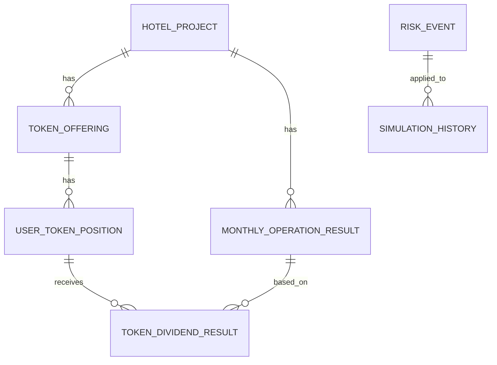

# ERD

## 주요 테이블

| 테이블 | 역할 |
|---|---|
| `hotel_project` | 호텔 프로젝트 기본 정보 |
| `token_offering` | 가상 STO 발행 조건 |
| `user_token_position` | 사용자 모의 투자 포지션 |
| `monthly_operation_result` | 월별 호텔 운영 결과 |
| `token_dividend_result` | 사용자별 배당 계산 결과 |
| `risk_event` | 리스크 이벤트 정의 |
| `simulation_history` | 통합 시뮬레이션 실행 이력 |

## Mermaid ERD

상세 SQL은 `db/schema.sql`을 확인합니다.
